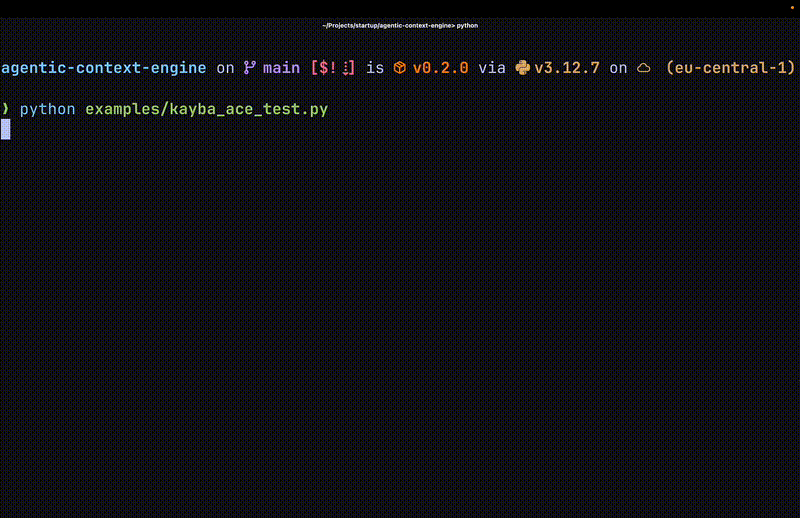
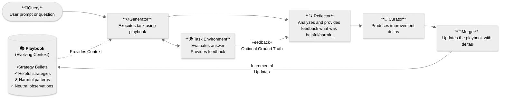

# Agentic Context Engine (ACE) 


[](https://discord.gg/BBbwMMc7f4)
[](https://twitter.com/kaybaai)
[](https://badge.fury.io/py/ace-framework)
[](https://www.python.org/downloads/)


**AI agents that get smarter with every task 🧠**

Agentic Context Engine learns from your agent's successes and failures. Just plug in and watch your agents improve.

Star ⭐️ this repo if you find it useful!

---

## Quick Start

### 1. Install

```bash
pip install ace-framework
```

### 2. Set Your API Key

```bash
export OPENAI_API_KEY="your-api-key"
# Or use Claude, Gemini, or 100+ other providers
```

### 3. Create Your First ACE Agent

```python
from ace import ACE, LiteLLMClient

# Initialize with any LLM
client = LiteLLMClient(model="gpt-4o-mini")
ace = ACE(client)

# Teach your agent (it learns from examples)
ace.learn([
    {"question": "What is 2+2?", "answer": "4"},
    {"question": "What is 5*3?", "answer": "15"}
])

# Now it can solve new problems
result = ace.answer("What is 7*8?")
print(result)  # Agent applies learned strategies
```

That's it! Your agent is now learning and improving. 🎉

---

## Why Agentic Context Engine (ACE)?

AI agents make the same mistakes repeatedly.

ACE enables agents to learn from execution feedback: what works, what doesn't, and continuously improve. <br> No training data, no fine-tuning, just automatic improvement.

### Clear Benefits
- 📈 **20-35% Better Performance**: Proven improvements on complex tasks
- 🧠 **Self-Improving**: Agents get smarter with each task
- 🔄 **No Context Collapse**: Preserves valuable knowledge over time
- 🚀 **100+ LLM Providers**: Works with OpenAI, Anthropic, Google, and more

---

## Demos

### 🌊 The Seahorse Emoji Challenge

A challenge where LLMs often hallucinate that a seahorse emoji exists (it doesn't).
Watch ACE learn from its own mistakes in real-time. This demo shows how ACE handles the infamous challenge!



In this example:
- **Round 1**: The agent incorrectly outputs 🐴 (horse emoji)
- **Self-Reflection**: ACE reflects without any external feedback
- **Round 2**: With learned strategies from ACE, the agent successfully realizes there is no seahorse emoji

Try it yourself:
```bash
python examples/kayba_ace_test.py
```

---

## How does Agentic Context Engine (ACE) work?

*Based on the [ACE research framework](https://arxiv.org/abs/2510.04618) from Stanford & SambaNova.*

ACE uses three specialized roles that work together:
1. **🎯 Generator** - Executes tasks using learned strategies from the playbook
2. **🔍 Reflector** - Analyzes what worked and what didn't after each execution
3. **📝 Curator** - Updates the playbook with new strategies based on reflection

ACE teaches your agent and internalises:
- **✅ Successes** → Extract patterns that work
- **❌ Failures** → Learn what to avoid
- **🔧 Tool usage** → Discover which tools work best for which tasks
- **🎯 Edge cases** → Remember rare scenarios and how to handle them

The magic happens in the **Playbook**—a living document of strategies that evolves with experience. <br>
**Key innovation:** All learning happens **in context** through incremental updates—no fine-tuning, no training data, and complete transparency into what your agent learned.



---

## Installation Options

```bash
# Basic installation
pip install ace-framework

# With LangChain support
pip install ace-framework[langchain]

# With all features
pip install ace-framework[all]

# Development
pip install ace-framework[dev]
```

---

## Configuration

ACE works with any LLM provider through LiteLLM:

```python
# OpenAI
client = LiteLLMClient(model="gpt-4o")

# Anthropic Claude
client = LiteLLMClient(model="claude-3-5-sonnet-20241022")

# Google Gemini
client = LiteLLMClient(model="gemini-pro")

# Ollama (local)
client = LiteLLMClient(model="ollama/llama2")

# With fallbacks for reliability
client = LiteLLMClient(
    model="gpt-4",
    fallbacks=["claude-3-haiku", "gpt-3.5-turbo"]
)
```

---

## Documentation

- [Quick Start Guide](docs/QUICK_START.md) - Get running in 5 minutes
- [API Reference](docs/API_REFERENCE.md) - Complete API documentation
- [Examples](examples/) - Ready-to-run code examples
- [Prompt Engineering](docs/PROMPT_ENGINEERING.md) - Advanced prompt techniques

---

## Contributing

We love contributions! Check out our [Contributing Guide](CONTRIBUTING.md) to get started.

---

## Acknowledgment

Based on the [ACE paper](https://arxiv.org/abs/2510.04618) and inspired by [Dynamic Cheatsheet](https://arxiv.org/abs/2504.07952).

If you use ACE in your research, please cite:
```bibtex
@article{zhang2024ace,title={Agentic Context Engineering},author={Zhang et al.},journal={arXiv:2510.04618},year={2024}}
```


<div align="center">

<br>

**⭐ Star this repo if you find it useful!** <br>
**Built with ❤️ by [Kayba](https://kayba.ai) and the open-source community.**

</div>
