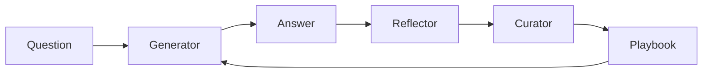

# 🎯 ACE Framework

**Build self-improving AI agents that learn from experience**

[](https://badge.fury.io/py/ace-framework)
[](https://www.python.org/downloads/)
[](https://opensource.org/licenses/MIT)
[](https://github.com/Kayba-ai/agentic-context-engine/actions)

## 🌟 What is ACE Framework?

ACE (Agentic Context Engineering) is a framework that makes your AI agents smarter over time. Unlike traditional prompting, ACE agents build a "playbook" of strategies that evolve based on experience - learning what works, what doesn't, and continuously improving.

**Think of it as giving your AI agents a living notebook where they write down lessons learned and apply them to future tasks.**

### Why ACE?

- 🧠 **Self-Improving**: Agents get smarter with each task
- 📈 **20-35% Better Performance**: Proven improvements on complex tasks
- 🔄 **No Context Collapse**: Preserves valuable knowledge over time
- 🚀 **100+ LLM Providers**: Works with OpenAI, Anthropic, Google, and more
- ⚡ **Production Ready**: Built-in retries, fallbacks, and error handling

## 🚀 Quick Start (5 minutes)

### 1. Install

```bash
pip install ace-framework
```

### 2. Set Your API Key

```bash
export OPENAI_API_KEY="your-api-key"
# Or use Claude, Gemini, or 100+ other providers
```

### 3. Create Your First ACE Agent

```python
from ace import ACE, LiteLLMClient

# Initialize with any LLM
client = LiteLLMClient(model="gpt-4o-mini")
ace = ACE(client)

# Teach your agent (it learns from examples)
ace.learn([
    {"question": "What is 2+2?", "answer": "4"},
    {"question": "What is 5*3?", "answer": "15"}
])

# Now it can solve new problems
result = ace.answer("What is 7*8?")
print(result)  # Agent applies learned strategies
```

That's it! Your agent is now learning and improving. 🎉

## 📦 Installation Options

```bash
# Basic installation
pip install ace-framework

# With LangChain support
pip install ace-framework[langchain]

# With all features
pip install ace-framework[all]

# Development
pip install ace-framework[dev]
```

## ⚙️ Configuration

ACE works with any LLM provider through LiteLLM:

```python
# OpenAI
client = LiteLLMClient(model="gpt-4o")

# Anthropic Claude
client = LiteLLMClient(model="claude-3-5-sonnet-20241022")

# Google Gemini
client = LiteLLMClient(model="gemini-pro")

# Ollama (local)
client = LiteLLMClient(model="ollama/llama2")

# With fallbacks for reliability
client = LiteLLMClient(
    model="gpt-4",
    fallbacks=["claude-3-haiku", "gpt-3.5-turbo"]
)
```

## 🎯 Core Concepts

ACE uses three specialized roles that work together:

1. **🎯 Generator** - Produces answers using the playbook
2. **🔍 Reflector** - Analyzes what worked and what didn't
3. **📝 Curator** - Updates the playbook with new strategies

The magic happens in the **Playbook** - a living document of strategies that evolves with experience.

## 💡 Usage Examples

### Basic Q&A Agent

```python
from ace import OfflineAdapter, Generator, Reflector, Curator
from ace import LiteLLMClient, SimpleEnvironment

# Setup components
client = LiteLLMClient(model="gpt-4o-mini")
generator = Generator(client)
reflector = Reflector(client)
curator = Curator(client)

# Create and train an adapter
adapter = OfflineAdapter(generator, reflector, curator)
environment = SimpleEnvironment()

# Train on examples
training_samples = [
    {"question": "What's the capital of France?", "answer": "Paris"},
    {"question": "What's 2+2?", "answer": "4"}
]

results = adapter.run(training_samples, environment, epochs=2)

# Save the learned strategies
adapter.playbook.save_to_file("my_agent.json")
```

### Online Learning (Learn While Running)

```python
from ace import OnlineAdapter

# Agent improves while processing real tasks
adapter = OnlineAdapter(
    playbook=existing_playbook,
    generator=generator,
    reflector=reflector,
    curator=curator
)

# Process tasks one by one, learning from each
for task in real_world_tasks:
    result = adapter.process(task, environment)
    # Agent automatically updates its strategies
```


## 📚 Documentation

- [Quick Start Guide](docs/QUICK_START.md) - Get running in 5 minutes
- [API Reference](docs/API_REFERENCE.md) - Complete API documentation
- [Examples](examples/) - Ready-to-run code examples
- [Prompt Engineering](docs/PROMPT_ENGINEERING.md) - Advanced prompt techniques

## 🏗️ Architecture



ACE prevents "context collapse" through incremental updates rather than full rewrites, preserving valuable strategies over time.

## 🤝 Contributing

We love contributions! Check out our [Contributing Guide](CONTRIBUTING.md) to get started.

## 📄 License

MIT License - see [LICENSE](LICENSE) file

## 🔬 Citation

If you use ACE in your research, please cite:

```bibtex
@article{zhang2024ace,
  title={Agentic Context Engineering},
  author={Zhang et al.},
  journal={arXiv:2510.04618},
  year={2024}
}
```

## 🙏 Acknowledgments

Built with ❤️ by [Kayba](https://kayba.ai) and the open-source community.

Based on the [ACE paper](https://arxiv.org/abs/2510.04618) and inspired by [Dynamic Cheatsheet](https://arxiv.org/abs/2504.07952).

---

**Ready to build self-improving AI agents?** [Get started now →](docs/QUICK_START.md)