# ACE Framework - Agentic Context Engine

**Build self-improving AI agents that learn from experience🧠.**

Agentic Context Engine is the easiest way to enhance your AI Agents through continuous learning. 

Star ⭐️ this repo if you find it useful!

[](https://badge.fury.io/py/ace-framework)
[](https://www.python.org/downloads/)
[](https://opensource.org/licenses/MIT)
[](https://github.com/Kayba-ai/agentic-context-engine/actions)

## What is ACE Framework?

**Think of it as giving your AI agents a living notebook where they write down lessons learned and apply them to future tasks.**
ACE (Agentic Context Engineering) framework makes your AI agents smarter over time. Unlike traditional prompting, ACE agents build a "playbook" of strategies that evolve based on experience - learning what works, what doesn't, and continuously improving.

### Clear Benefits
- 🧠 **Self-Improving**: Agents get smarter with each task
- 📈 **20-35% Better Performance**: Proven improvements on complex tasks
- 🔄 **No Context Collapse**: Preserves valuable knowledge over time
- 🚀 **100+ LLM Providers**: Works with OpenAI, Anthropic, Google, and more

### Core Concepts

ACE uses three specialized roles that work together:

1. **🎯 Generator** - Produces answers using the playbook
2. **🔍 Reflector** - Analyzes what worked and what didn't
3. **📝 Curator** - Updates the playbook with new strategies

The magic happens in the **Playbook** - a living document of strategies that evolves with experience.
ACE prevents "context collapse" through incremental updates rather than full rewrites, preserving valuable strategies over time.

```mermaid
---
config:
  look: neo
  theme: neutral
---
flowchart LR
    Playbook[("`**📚 Playbook**<br>(Evolving Context)<br><br>•Strategy Bullets<br> ✓ Helpful strategies <br>✗ Harmful patterns <br>○ Neutral observations`")]
    Start(["**📝Query** <br>User prompt or question"]) --> Generator["**⚙️Generator** <br>Creates initial trajectory and answer with tags"]
    Generator --> Reflector
    Playbook -. Provides Context .-> Generator
    Environment["**🌍 Task Environment**<br>Evaluates answer<br>Provides feedback"] -- Feedback+ <br>Optional Ground Truth --> Reflector
    Reflector["**🔍 Reflector**<br>Analyzes and provides feedback what was helpful/harmful"]
    Reflector --> Curator["**📝 Curator**<br>Produces improvement deltas"]
    Curator --> DeltaOps["**🔀Merger** <br>Updates the playbook with deltas"]
    DeltaOps -- Incremental<br>Updates --> Playbook
    Generator <--> Environment
```



## Quick Start (~5 minutes)

### 1. Install

```bash
pip install ace-framework
```

### 2. Set Your API Key

```bash
export OPENAI_API_KEY="your-api-key"
# Or use Claude, Gemini, or 100+ other providers
```

### 3. Create Your First ACE Agent

```python
from ace import (
    OfflineAdapter, Generator, Reflector, Curator,
    LiteLLMClient, Sample, TaskEnvironment, EnvironmentResult, Playbook
)

# Initialize with any LLM
client = LiteLLMClient(model="gpt-4o-mini")

# Create the three ACE roles
generator = Generator(client)
reflector = Reflector(client)
curator = Curator(client)

# Create an adapter with an empty playbook
adapter = OfflineAdapter(
    playbook=Playbook(),
    generator=generator,
    reflector=reflector,
    curator=curator
)

# Define a simple environment for math problems
class MathEnvironment(TaskEnvironment):
    def evaluate(self, sample, generator_output):
        question = sample.question
        final_answer = generator_output.final_answer

        # Check if the answer is correct
        if "2+2" in question and final_answer.strip() == "4":
            return EnvironmentResult(feedback="Correct!", ground_truth="4")
        elif "5*3" in question and final_answer.strip() == "15":
            return EnvironmentResult(feedback="Correct!", ground_truth="15")
        else:
            return EnvironmentResult(feedback="Let me check that calculation.")

# Create training samples
samples = [
    Sample(question="What is 2+2?", ground_truth="4"),
    Sample(question="What is 5*3?", ground_truth="15")
]

# Train the agent
environment = MathEnvironment()
results = adapter.run(samples, environment, epochs=1)

# Now use the trained agent
result = adapter.generator.generate(
    "What is 7*8?",
    adapter.playbook
)
print(result.final_answer)  # Agent applies learned strategies
```

That's it! Your agent is now learning and improving. 🎉

## Installation Options

```bash
# Basic installation
pip install ace-framework

# With LangChain support
pip install ace-framework[langchain]

# With all features
pip install ace-framework[all]

# Development
pip install ace-framework[dev]
```

## Configuration

ACE works with any LLM provider through LiteLLM:

```python
# OpenAI
client = LiteLLMClient(model="gpt-4o")

# Anthropic Claude
client = LiteLLMClient(model="claude-3-5-sonnet-20241022")

# Google Gemini
client = LiteLLMClient(model="gemini-pro")

# Ollama (local)
client = LiteLLMClient(model="ollama/llama2")

# With fallbacks for reliability
client = LiteLLMClient(
    model="gpt-4",
    fallbacks=["claude-3-haiku", "gpt-3.5-turbo"]
)
```

## Demos

### Basic Q&A Agent

```python
from ace import (
    OfflineAdapter, Generator, Reflector, Curator,
    LiteLLMClient, Sample, TaskEnvironment, EnvironmentResult, Playbook
)

# Setup components
client = LiteLLMClient(model="gpt-4o-mini")
generator = Generator(client)
reflector = Reflector(client)
curator = Curator(client)

# Create a simple Q&A environment
class QAEnvironment(TaskEnvironment):
    def evaluate(self, question, trajectory, final_answer):
        # Simple evaluation based on known answers
        if "capital of France" in question.lower():
            if "paris" in final_answer.lower():
                return EnvironmentResult(feedback="Correct!", ground_truth="Paris")
        elif "2+2" in question:
            if "4" in final_answer:
                return EnvironmentResult(feedback="Correct!", ground_truth="4")
        return EnvironmentResult(feedback="Answer provided.")

# Create and train an adapter
adapter = OfflineAdapter(
    playbook=Playbook(),
    generator=generator,
    reflector=reflector,
    curator=curator
)
environment = QAEnvironment()

# Train on examples
training_samples = [
    Sample(question="What's the capital of France?", ground_truth="Paris"),
    Sample(question="What's 2+2?", ground_truth="4")
]

results = adapter.run(training_samples, environment, epochs=2)

# Save the learned strategies
adapter.playbook.save_to_file("my_agent.json")
```

### Online Learning (Learn While Running)

```python
from ace import OnlineAdapter, Playbook, Sample

# Load an existing playbook or create a new one
existing_playbook = Playbook.load_from_file("my_agent.json")
# or Playbook() for a fresh start

# Agent improves while processing real tasks
adapter = OnlineAdapter(
    playbook=existing_playbook,
    generator=generator,
    reflector=reflector,
    curator=curator
)

# Process tasks one by one, learning from each
real_world_tasks = [
    Sample(question="What's 10*10?"),
    Sample(question="What's the capital of Germany?")
]

for task in real_world_tasks:
    result = adapter.run([task], environment, epochs=1)
    # Agent automatically updates its strategies
    print(f"Answer: {result[0].final_answer}")
```

## Documentation

- [Quick Start Guide](docs/QUICK_START.md) - Get running in 5 minutes
- [API Reference](docs/API_REFERENCE.md) - Complete API documentation
- [Examples](examples/) - Ready-to-run code examples
- [Prompt Engineering](docs/PROMPT_ENGINEERING.md) - Advanced prompt techniques

## Contributing

We love contributions! Check out our [Contributing Guide](CONTRIBUTING.md) to get started.

## Acknowledgment

<div align="center">

**Star ⭐ this repo if you find it useful!** <br>
**Built with ❤️ by [Kayba](https://kayba.ai) and the open-source community**

Based on the [ACE paper](https://arxiv.org/abs/2510.04618) and inspired by [Dynamic Cheatsheet](https://arxiv.org/abs/2504.07952).
If you use ACE in your research, please cite:
```bibtex
@article{zhang2024ace,title={Agentic Context Engineering},author={Zhang et al.},journal={arXiv:2510.04618},year={2024}}
```

</div>
